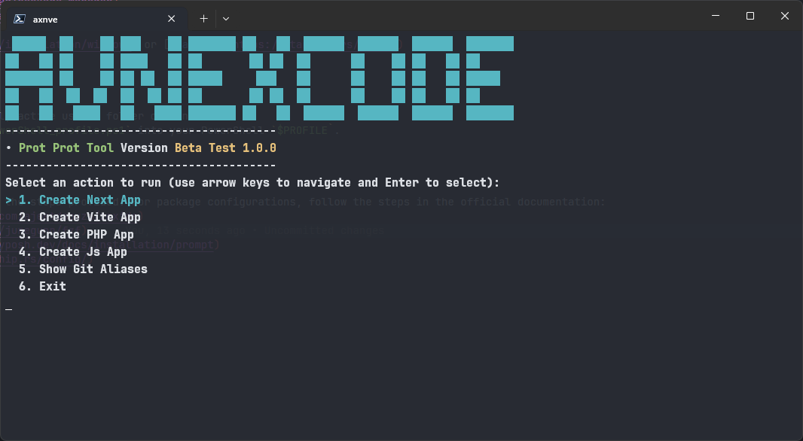

# Display

## Description

React Project Initializer is a cutting-edge tool designed to supercharge your React development workflow. It provides a seamless setup experience, pre-configuring essential libraries and tools to get you coding faster. With built-in support for Axios, TanStack/React-Query, Formik, React-Router-Dom, React-Icons, and Zod, you'll have a robust foundation for building modern, efficient React applications right from the start.

## Required Packages

**Optional:**
- [Chocolatey](https://chocolatey.org/install): The package manager for Windows, making software installation a breeze.
- [Scoop](https://scoop.sh/): A command-line installer for Windows, offering quick and easy package management.

**Mandatory:**
- [Node.js](https://nodejs.org/en/download/package-manager): The backbone of our development environment. Ensure you have the latest LTS version for optimal performance.
- [PNPM](https://pnpm.io/id/installation): A fast, disk space efficient package manager that's revolutionizing the way we handle dependencies in JavaScript projects. PNPM stands for "Performant NPM" and offers several key advantages:

  - **Speed**: PNPM is significantly faster than npm and Yarn, especially for larger projects.
  - **Disk Space Efficiency**: It uses a unique content-addressable storage system that links packages instead of copying them, saving gigabytes of disk space.
  - **Strict**: PNPM creates a non-flat `node_modules` structure, preventing access to arbitrarily nested dependencies and ensuring your project only uses what it declares.
  - **Monorepo Support**: Built-in features for managing monorepos, making it easier to work with multi-package repositories.
  - **Compatibility**: Works with the npm ecosystem seamlessly, allowing you to use it as a drop-in replacement for npm or Yarn in most projects.

  Installing PNPM is straightforward and can be done via npm itself or through various system package managers. Once installed, you can use PNPM commands that are nearly identical to npm, making the transition smooth and easy.
- [Zoxide](https://github.com/ajeetdsouza/zoxide): A smarter cd command that learns your habits, making navigation through your project a joy.
- [FZF](https://github.com/junegunn/fzf): A command-line fuzzy finder that will revolutionize how you search for files and commands.
- [Oh-My-Posh](https://ohmyposh.dev/docs/installation/windows) or [Starship](https://starship.rs/guide/): Elevate your terminal experience with these powerful prompt customization tools.
- PowerShell version 7++: The latest version of PowerShell, providing enhanced scripting capabilities and improved performance.

## Installation

1. Clone the repository into the currently active user's folder on Windows.
2. Import the main package `Microsoft.PowerShell_profile.ps1` into your PowerShell `$PROFILE`.
3. Restart the terminal.

## Usage

Use the command `discommends` and follow the steps provided. For package configurations, follow the steps in the official documentation:
- [Zoxide Documentation](https://github.com/ajeetdsouza/zoxide)
- [FZF Documentation](https://github.com/junegunn/fzf)
- [Oh-My-Posh Documentation](https://ohmyposh.dev/docs/installation/prompt)
- [Starship Documentation](https://starship.rs/config/)
